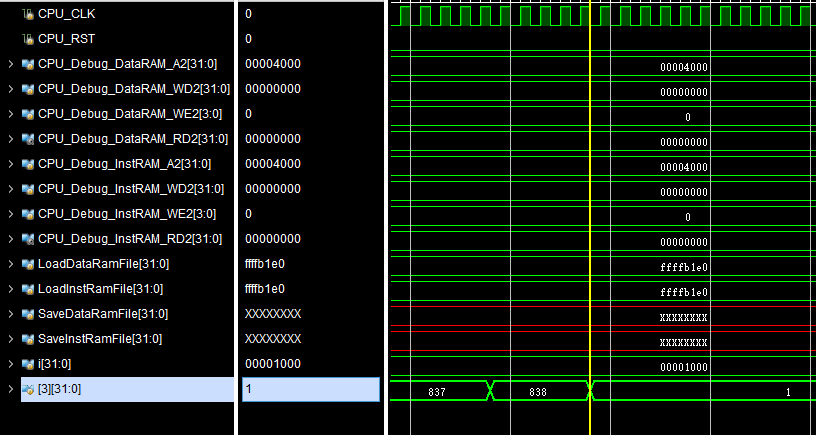

# 体系结构 Lab2 实验报告

**张立夫 PB15020718**

##实验目标

熟悉了解 RISCV 指令集，了解其编码，实现 RISCV 指令集流水线 CPU，并且使其能够通过官方测试。

##实验环境和工具

- Windows 10 (Parallels Desktop 14 for Mac)
- 2.8 GHz Intel Core i7
- Vivado 2017.4
- Visual Studio Code for Mac

##实验内容及过程

因为我是一次完成全部的内容，并没有分阶段，所以是对实验过程整体的记录

### 1. Control Unit

这一部分是整个实验中的核心，也是最棘手的部分，在本部分中，我才用了通过 `opcode` 以及 `funct3` 和 `funct7` 位进行判断具体指令，利用 `case` 对各个指令进行相关信号赋值，因为以前做组成原理的时候就采用的这个方式，所以更熟悉一些，故没有采用分解指令的方式进行对控制信号的赋值。下面分不同指令进行讨论：

首先在 `always` 最开始，对三个值进行初始默认赋值，以简化后续指令需要修改的部分：

```verilog
always@(Op or Fn3 or Fn7) begin
    BranchTypeD = `NOBRANCH;
    RegWriteD = `NOREGWRITE;
    MemWriteD = 0;
```

#### 1.1 整数运算指令

这部分包括 R 类，I 类和 U 类指令

##### 1.1.1 R 类指令

整数运算指令中的 R 类指令即为寄存器与寄存器作为两个源操作数，结果保存到 `rd` 寄存器中，指令编码如下图：


除了 `opcode` 位以外，还需要根据 `funct3` 位和 `funct7` 位进行判断才能确定具体的一条指令，在 `Control Unit` 中对判断出来的不同指令赋予变量 `AluContrlD` 相对应的在 `Parameters.v` 中定义好的参数即可。除此之外，统一对 R 类指令给以下信号进行赋值：

```verilog
RegWriteD = `LW;					// 字对齐
RegReadD = 2'b11;					// 读取两个寄存器
ImmType = `RTYPE;					// R 类指令
```

##### 1.1.2 I 类指令

整数运算指令中的 I 类指令即为寄存器与立即数作为两个源操作数，结果保存到 `rd` 寄存器中，指令编码如下图：


与 R 类指令相同，仅需要根据不同的 case 判断出来的某个具体的指令中，修改 `AluContrlD` 信号为对应的参数即可，在 `case` 判断之前统一默认赋值如下：

```verilog
RegReadD = 2'b10;					// 读取一个寄存器
ImmType = `ITYPE;					// I 类指令
RegWriteD = `LW						// 字对齐
```

##### 1.1.3 U 类指令

U 类指令在本次实验中只有 `AUIPC` 和 `LUI` 这两条，其指令编码如下：


`LUI` 将立即数放到目标寄存器 `rd` 的高20位，将低12 位置 0。

`AUIPC` 用于构建 PC 相对地址，从20 位立即数构建一个 32 位偏移量，将其低 12 位置 0，然后将这个偏移量加到 PC 上，最后将结果写入寄存器 `rd`。

上述两个指令的控制信号如下：

```verilog
7'b0110111: begin       // lui
    ImmType = `UTYPE;
    RegWriteD = `LW;
    RegReadD = 0;				// 不读寄存器
    AluContrlD = `LUI;
end
7'b0010111: begin       // auipc
    ImmType = `UTYPE;
    RegWriteD = `LW;
    RegReadD = 0;
    AluContrlD = `ADD;
end
```

#### 1.2 Load 指令

对于 Load 指令，是根据 `opcode` 和 `funct3` 进行具体指令的判断，根据不同指令，对 `RegWriteD` 信号赋予相对应的参数，对 Load 指令统一赋予的相关信号变量的值如下：

```verilog
7'b0000011: begin       // load
    RegReadD = 2'b10;		// 读取一个寄存器地址
    AluContrlD = `ADD;
    ImmType = `ITYPE;
```

#### 1.3 Store 指令

对于 Store 指令，同样是根据 `opcode` 和 `funct3` 进行相关具体指令的判断，对于不同长度保存的指令，对 `MemWriteD` 信号赋予相对应的参数值，对 Store 指令统一赋予的相关信号变量的值如下：

```verilog
7'b0100011: begin       // store
    RegReadD = 2'b11;
    AluContrlD = `ADD;
    ImmType = `STYPE;
```

#### 1.4 分支跳转指令

对于有条件分支跳转指令，对不同的具体指令，对控制信号 `BranchTypeD` 赋予相对应的参数值，除此之外，统一对分支指令的以下变量进行赋值：

```verilog
7'b1100011: begin       // branch
    RegReadD = 2'b11;
    ImmType = `BTYPE
```

#### 1.5 无条件跳转指令

对于无条件跳转指令，在本实验中即为 `JAL` 指令和 `JALR` 指令。因为这两个指令都要写入寄存器，所以需要将 `RegWriteD` 信号设置为 ``LW` ，这也是我在实验过程中遇到的最大的一个坑，具体的控制信号如下：

```verilog
7'b1101111: begin       // jal
    ImmType = `JTYPE;
    RegReadD = 0;				// 不读取寄存器
    AluContrlD = `ADD;
    RegWriteD = `LW;
end
7'b1100111: begin       // jalr
    RegReadD = 2'b10;		// 要读取寄存器
    AluContrlD = `ADD;
    ImmType = `ITYPE;		// 注意是 ITYPE
    RegWriteD = `LW;
end
```

#### 1.6 其它相关控制信号

除了上述指令中涉及到的控制信号以外，还需要对其他的控制信号进行处理。

- `JalD` 信号和 `JalrD` 信号，即为无条件跳转的两条指令的控制信号，只需要在对应指令时置 1 即可；
- `MemToRegD` 信号，即为 Load 指令的时候置 1 即可，用于后面的相关部分的处理；
- `LoadNpcD` 信号，用于无条件跳转指令保存 PC 值，在无条件跳转指令时置 1 即可；
- `AluSrc1D` 信号，ALU 源 1 的选择，有效表示选择 PC，仅在 `AUIPC` 这条指令时置为 1，即对 PC 进行运算；
- `AluSrc2D` 信号，ALU 源 2 的选择，表示选择寄存器还是立即数。

### 2. DataExt

根据信号 `RegWrite` 选择对读取出来的数据进行符号位扩展或者进行零扩展，最终以 32 位的形式进行输出，以保存到寄存器中，具体代码形式如下：

```verilog
case(RegWriteW)
    `NOREGWRITE: OUT = 0;
    `LB: begin
        case(LoadedBytesSelect)
            2'b00: OUT = { {25{IN[7]}}, IN[6:0] };
            2'b01: OUT = { {25{IN[15]}}, IN[14:8] };
            2'b10: OUT = { {25{IN[23]}}, IN[22:16] };
            2'b11: OUT = { {25{IN[31]}}, IN[30:24] };
        endcase
     end
  ...
```

### 3. ImmOperandUnit

根据下表中不同指令的立即数的编码，对输出进行相应的安排即可：


```verilog
    always@(*)
    begin
        case(Type)
            `ITYPE: Out <= { {21{In[31]}}, In[30:20] };
            `RTYPE: Out <= 32'b0;
            `STYPE: Out <= { {21{In[31]}}, In[30:25], In[11:7] };
            `BTYPE: Out <= { {20{In[31]}}, In[7], In[30:25], In[11:8], 1'b0 };
            `UTYPE: Out <= { In[31:12], 12'b0 };
            `JTYPE: Out <= { {12{In[31]}}, In[19:12], In[20], In[30:21], 1'b0 };
            default: Out <= 32'hxxxxxxxx;
        endcase
    end
```

### 4. ALU

ALU 只需要根据由 `Control Unit` 输出的控制信号 `AluContrl` ，执行相应的运算操作即可：

```verilog
    always@(*) begin
        case(AluContrl)
            `SLL: AluOut = Operand1 << Operand2[4:0];
            `SRL: AluOut = Operand1 >> Operand2[4:0];
            `SRA: AluOut = $signed(Operand1) >>> Operand2[4:0];
            `ADD: AluOut = $signed(Operand1) + $signed(Operand2);
            `SUB: AluOut = $signed(Operand1) - $signed(Operand2);
            `XOR: AluOut = Operand1 ^ Operand2;
            `OR:  AluOut = Operand1 | Operand2;
            `AND: AluOut = Operand1 & Operand2;
            `SLT: AluOut = ($signed(Operand1) < $signed(Operand2)) ? 32'b1 : 32'b0;
            `SLTU: AluOut = (Operand1 < Operand2) ? 32'b1 : 32'b0;
            `LUI: AluOut = Operand2;
            default: AluOut <= 32'b0;
        endcase
    end
```

### 5. NPC_Generator

对于 NPC 模块，只需要根据不同的控制信号判断，将指定的输入数据输出即可，这里要注意各个跳转和分支指令的优先级：`BranchE` = `JalrE` > `JalD` > `PC+4` ，所以最终模块实现为：

```verilog
    always@(*) begin
        if (BranchE) begin
            PC_In = BranchTarget;
        end
        else if (JalrE) begin
            PC_In = JalrTarget;
        end
        else if (JalD) begin
            PC_In = JalTarget;
        end
        else begin
            PC_In = PCF + 4;
        end
    end
```

###6. BranchDecisionMaking

这个模块和 ALU 模块类似，只需要通过判断 `BranchTypeE` 信号，对不同类型进行相应的计算操作即可，最终输出为跳转信号 `BranchE` ：

```verilog
    always@(*) begin
        case(BranchTypeE)
            `NOBRANCH: BranchE = 0;
            `BEQ: BranchE = (Operand1 == Operand2);
            `BNE: BranchE = (Operand1 != Operand2);
            `BLT: BranchE = ($signed(Operand1) < $signed(Operand2));
            `BLTU: BranchE = (Operand1 < Operand2);
            `BGE: BranchE = ($signed(Operand1) >= $signed(Operand2));
            `BGEU: BranchE = (Operand1 >= Operand2);
            default: BranchE = 0;
        endcase
    end
```

### 7. HarzardUnit

该模块为另一个非常关键的部分，在这一模块中需要考虑数据的转发，无法转发的数据进行 Stall，以及跳转指令的 Flush。

#### 7.1 数据转发

对于数据相关，其转发的数据来源可能是上一条指令或者是上上条指令，即所处的阶段为 MEM 或 WB 阶段。注意到从 MEM 阶段转发的数据的优先级要高于从 WB 阶段，故要在条件判断的时候防止在两者都对同一个被使用的寄存器进行修改时选择从 WB 阶段进行转发，故最终代码如下：

```verilog
        Forward1E = 0;
        Forward2E = 0;

				if (RegWriteM != 0 && RdM != 0) begin				//MEM 转发
            if (RdM == Rs1E && RegReadE[1])
                Forward1E = 2'b10;
            if (RdM == Rs2E && RegReadE[0])
                Forward2E = 2'b10;
        end
				if (RegWriteW != 0 && RdW != 0) begin				// WB 转发
          if (!(RegWriteM != 0 && RdM == Rs1E))			// 判断是否和 MEM 冲突
                if (RdW == Rs1E && RegReadE[1])
                    Forward1E = 2'b01;
          if (!(RegWriteM != 0 && RdM == Rs2E))			// 判断是否和 MEM 冲突
                if (RdW == Rs2E && RegReadE[0])
                    Forward2E = 2'b01;
        end
```

#### 7.2 无法转发的 Stall

当满足下面的情况时进行对 IF 和 ID 的段寄存器的 Stall：

```verilog
MemToRegE && (RdE == Rs1D || RdE == Rs2D) && RdE != 0
```

#### 7.3 跳转指令 Flush

当进行有条件分支跳转或者 `JALR` 跳转时，需要对 ID 和 EX 段进行 Flush，而如果是 `JAL` 跳转时，只需要对 ID 段进行 Flush。

## 实验结果

最终仿真三个助教所给的测试文件效果如下，其中三号寄存器均正确的停到了 1：

- 1testAll:

  

- 2testAll:

  

- 3testAll:

  

##实验总结

因为之前组成原理课上做过流水线 CPU，所以本实验大体上并没有太多的问题，基本上各个模块都比较熟悉，尤其是对 Control Unit 和 Harzard Unit 两个模块的熟悉极大的降低了实验的难度。

除此之外，这个实验也熟悉了 RISC-V 的指令集，毕竟和之前做的 MIPS 指令集还是有很多不同的，总体上来说收获还是蛮大的，尤其是对于指令的编码，以及对控制信号的处理部分。

其中需要说的一个自己遇到的坑就是在跳转指令处的控制信号一开始并没有考虑全面，没有对 `RegWriteD` 信号进行赋值，导致后面找了好久的 bug，归根到底还是对各个指令作用的不够熟悉，借此实验也进一步有了一些认识。

##改进意见

无！到目前为止体系结构的实验都非常棒，可以算是大学几年来设计安排最好的实验之一了，给同学安排的任务量也比较合适，实验的指导、文档也十分充足，基本上不会遇到看到实验要求两眼一抹黑的情况，给辛苦的助教一个赞！