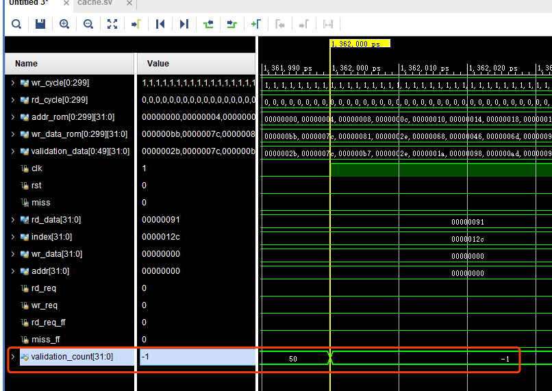
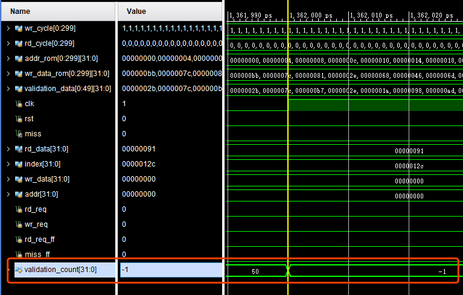

# Lab3 Cache

**PB15020718 张立夫**

## Cache 设计思路

对于本次实验，主要的代码工作在于实现两个 Cache 调换策略，即 FIFO 和 LRU 策略。下面分别对这两个还出策略的设计进行说明：

### FIFO 实现思路

对于 FIFO 调换策略，每次换出的路即为当前 set 中存在最久的路，根据这一性质，即可进行如下设计：

定义数组变量 `way_count[SET_SIZE][WAY_CNT]` ，其中存储每一路自换入之后存在的时间，即在每一次换入时，对同 set 下其他路进行加一，每次需要换出时，首先判断是否存在 `valid == 0` 的路，如果存在，则直接将该路换出，否则换出 `way_count` 在该 set 下值最大的一路，选择的结果保存在变量 `swap_out_way` 中。

### LRU 实现思路

对于 LRU 调换策略，每次还出的为当前 set 中最长时间未被使用的一路，故有以下设计：

同样定义数组变量 `way_count[SET_SIZE][WAY_CNT]` ，该变量和 FIFO 策略公用，使用宏定义进行选择不同的策略。当一路被换入或者被命中时，其在 `way_count` 中的计数值设置为 WAY_CNT。若是命中情况，则对计数值大于命中路的计数值的路进行减一操作；若是换入新路的情况，则对其他的所有路的计数值全部减一。这样每次选择换出路的时候，首先判断有效位，若均有效，则直接找到计数值为 1 的一路即为最长时间未被使用的一路，作为换出路即可。

## 实验结果

### 1. Cache 正确性

运行阶段一的 testbench，检查 validation_count 变量：

#### FIFO

####LRU

对于 FIFO 和 LRU 策略，最后 validation_count 均变为 -1，表示策略均为正确的。

### 2. 性能分析

#### 2.1 矩阵乘法

#####2.1.1 LRU

固定 `LINE_ADDR_LEN` + `SET_ADDR_LEN` + `TAG_ADDR_LEN` = 16，使 `LINE_ADDR_LEN` + `SET_ADDR_LEN` 从 4 到 8 进行变化，固定 `WAY_CNT` = 4，进行综合与仿真，得到如下表，其中 L 代表 `LINE_ADDR_LEN` ，S 代表 `SET_ADDR_LEN` ：

| (L, S) |      LUT       | HIT / MISS  |
| :----: | :------------: | :---------: |
| (2, 2) |  1636 / 1.22%  | 3924 / 4524 |
| (2, 3) |  2699 / 2.01%  | 5008 / 3440 |
| (3, 2) |  4634 / 3.44%  | 4756 / 3692 |
| (2, 4) |  5331 / 3.96%  | 7428 / 1020 |
| (3, 3) |  4531 / 3.37%  | 7464 / 984  |
| (4, 2) |  8266 / 6.14%  | 7394 / 1054 |
| (2, 5) |  7956 / 5.91%  | 7867 / 581  |
| (3, 4) |  7827 / 5.82%  | 7941 / 507  |
| (4, 3) |  8605 / 6.39%  | 7930 / 518  |
| (5, 2) | 15045 / 11.18% | 7790 / 658  |
| (2, 6) | 15308 / 11.37% | 8256 / 192  |
| (3, 5) | 14172 / 10.53% |  8352 / 96  |
| (4, 4) | 13403 / 9.96 % |  8400 / 48  |
| (5, 3) | 16654 / 12.37% |  8424 / 24  |
| (6, 2) | 22656 / 16.83% |  8436 / 12  |

综合考虑资源占用和性能，因为在 `LINE_ADDR_LEN` + `SET_ADDR_LEN` = 8 时，资源占用过高，所以放弃使用，而对于 `LINE_ADDR_LEN` + `SET_ADDR_LEN` 值更小一些的情况下，缺失率太高，故也不进行考虑，所以最终选择 `LINE_ADDR_LEN = 3` 、`SET_ADDR_LEN = 4` ，对 `WAY_CNT` 进行进一步测试，考虑从 2 到 6 进行变化：

| WAY_CNT |     LUT      | HIT / MISS |
| :-----: | :----------: | :--------: |
|    2    | 3739 / 2.78% | 7478 / 970 |
|    3    | 5941 / 4.41% | 7833 / 615 |
|    4    | 7827 / 5.82% | 7941 / 507 |
|    5    | 9181 / 6.82% | 8158 / 290 |
|    6    | 9795 / 7.28% | 8352 / 96  |

因为在进行上面实验的时候忘了记录 FF 值，故只有 LUT，经过观察 LUT 与 FF 值基本上有线性关系，所以单独 LUT 也能在很大程度上反应资源占用。

综合上述情况，最终对于 LRU 所选择的参数为：`LINE_ADDR_LEN = 3` 、`SET_ADDR_LEN = 4` 、 `WAY_CNT = 5` 是一个较为合适的参数。

##### 2.1.2 FIFO

对于 FIFO，同样固定 `LINE_ADDR_LEN` + `SET_ADDR_LEN` + `TAG_ADDR_LEN` = 16，根据 LRU 的情况，为减少搜索量，使 `LINE_ADDR_LEN` + `SET_ADDR_LEN` 从 5 到 7 进行变化，固定 `WAY_CNT` = 4，进行综合与仿真，得到如下表，其中 L 代表 `LINE_ADDR_LEN` ，S 代表 `SET_ADDR_LEN` ：

| (L, S) |      LUT       |      FF       | HIT / MISS  |
| :----: | :------------: | :-----------: | :---------: |
| (2, 3) |  2498 / 1.86%  | 5255 / 1.95%  | 4688 / 3760 |
| (3, 2) |  3818 / 2.84%  | 5412 / 2.01%  | 4504 / 3944 |
| (2, 4) |  4671 / 3.47%  | 9735 / 3.62%  | 7176 / 1272 |
| (3, 3) |  4447 / 3.30%  | 9700 / 3.60%  | 7272 / 1176 |
| (4, 2) |  7734 / 5.75%  | 10257 / 3.81% | 7252 / 1196 |
| (2, 5) |  7484 / 5.56%  | 18631 / 6.92% | 7747 / 701  |
| (3, 4) |  7511 / 5.58%  | 18244 / 6.78% | 7851 / 597  |
| (4, 3) |  9112 / 6.77%  | 18625 / 6.92% | 7860 / 588  |
| (5, 2) | 16035 / 11.91% | 19967 / 7.42% | 7900 / 548  |

综合考虑资源占用和性能，选择 `LINE_ADDR_LEN = 3` 、`SET_ADDR_LEN = 4` ，对 `WAY_CNT` 进行进一步测试，考虑从 2 到 6 进行变化：

| WAY_CNT |      LUT      |      FF       | HIT / MISS  |
| :-----: | :-----------: | :-----------: | :---------: |
|    2    | 3864 / 2.87%  | 9668 / 3.59%  | 7306 / 1142 |
|    3    | 5760 / 4.28%  | 13956 / 5.18% | 7673 / 775  |
|    4    | 7511 / 5.58%  | 18244 / 6.78% | 7851 / 597  |
|    5    | 9077 / 6.74%  | 22532 / 8.37% | 8198 / 250  |
|    6    | 10556 / 7.84% | 26820 / 9.96% |  8352 / 96  |

综合上述结果，最终对于 FIFO 所选择的参数为：`LINE_ADDR_LEN = 3` 、`SET_ADDR_LEN = 4` 、 `WAY_CNT = 5` 是一个较为合适的参数。

对比 LRU 策略和 FIFO 策略，所用的局部最优参数均为 `LINE_ADDR_LEN = 3` 、`SET_ADDR_LEN = 4` 、 `WAY_CNT = 5` ，但是 FIFO 策略在矩阵乘法这个问题上相比 LRU 策略的效果略好，所以最终可以选择 FIFO 策略。

#### 2.2 快排程序

##### 2.2.1 LRU

对于快排程序，同样固定 `LINE_ADDR_LEN` + `SET_ADDR_LEN` + `TAG_ADDR_LEN` = 16，使 `LINE_ADDR_LEN` + `SET_ADDR_LEN` 从 5 到 7 进行变化，固定 `WAY_CNT` = 4，进行综合与仿真，得到如下表，其中 L 代表 `LINE_ADDR_LEN` ，S 代表 `SET_ADDR_LEN` ：

| (L, S) |      LUT       |      FF       | HIT / MISS |
| :----: | :------------: | :-----------: | :--------: |
| (2, 3) |  2699 / 2.01%  | 5255 / 1.95%  | 4868 / 409 |
| (3, 2) |  4634 / 3.44%  | 5412 / 2.01%  | 4971 / 306 |
| (2, 4) |  5331 / 3.96%  | 9735 / 3.62%  | 5126 / 151 |
| (3, 3) |  4531 / 3.37%  | 9700 / 3.60%  | 5196 / 81  |
| (4, 2) |  8266 / 6.14%  | 10257 / 3.81% | 5202 / 75  |
| (2, 5) |  7956 / 5.91%  | 18631 / 6.92% | 5197 / 80  |
| (3, 4) |  7827 / 5.82%  | 18244 / 6.78% | 5237 / 40  |
| (4, 3) |  8605 / 6.39%  | 18625 / 6.92% | 5257 / 20  |
| (5, 2) | 15045 / 11.18% | 19967 / 7.42% | 5267 / 10  |

综合考虑资源占用和性能，选择 `LINE_ADDR_LEN = 3` 、`SET_ADDR_LEN = 3` ，对 `WAY_CNT` 进行进一步测试，考虑从 2 到 6 进行变化：

| WAY_CNT |     LUT      |      FF       | HIT / MISS |
| :-----: | :----------: | :-----------: | :--------: |
|    2    | 2159 / 1.60% | 5396 / 2.00%  | 5057 / 220 |
|    3    | 3248 / 2.41% | 7548 / 2.80%  | 5115 / 162 |
|    4    | 4531 / 3.37% | 9700 / 3.60%  | 5196 / 81  |
|    5    | 5354 / 3.98% | 11852 / 4.40% | 5235 / 42  |
|    6    | 6508 / 4.84% | 14004 / 5.20% | 5237 / 40  |

综合上述结果，最终对于快排程序 LRU 策略所选择的参数为：`LINE_ADDR_LEN = 3` 、`SET_ADDR_LEN = 3` 、 `WAY_CNT = 5` 是一个较为合适的参数。

##### 2.2.2 FIFO

对于快排 FIFO，同样固定 `LINE_ADDR_LEN` + `SET_ADDR_LEN` + `TAG_ADDR_LEN` = 16， `LINE_ADDR_LEN` + `SET_ADDR_LEN` 从 5 到 7 进行变化，固定 `WAY_CNT` = 4，进行综合与仿真，得到如下表，其中 L 代表 `LINE_ADDR_LEN` ，S 代表 `SET_ADDR_LEN` ：

| (L, S) |      LUT       |      FF       | HIT / MISS |
| :----: | :------------: | :-----------: | :--------: |
| (2, 3) |  2498 / 1.86%  | 5255 / 1.95%  | 5007 / 270 |
| (3, 2) |  3818 / 2.84%  | 5412 / 2.01%  | 5130 / 147 |
| (2, 4) |  4671 / 3.47%  | 9735 / 3.62%  | 5165 / 112 |
| (3, 3) |  4447 / 3.30%  | 9700 / 3.60%  | 5218 / 59  |
| (4, 2) |  7734 / 5.75%  | 10257 / 3.81% | 5246 / 31  |
| (2, 5) |  7484 / 5.56%  | 18631 / 6.92% | 5197 / 80  |
| (3, 4) |  7511 / 5.58%  | 18244 / 6.78% | 5237 / 40  |
| (4, 3) |  9112 / 6.77%  | 18625 / 6.92% | 5257 / 20  |
| (5, 2) | 16035 / 11.91% | 19967 / 7.42% | 5267 / 10  |

综合考虑资源占用和性能，选择 `LINE_ADDR_LEN = 3` 、`SET_ADDR_LEN = 3` ，对 `WAY_CNT` 进行进一步测试，考虑从 2 到 6 进行变化：

| WAY_CNT |     LUT      |      FF       | HIT / MISS |
| :-----: | :----------: | :-----------: | :--------: |
|    2    | 2122 / 1.58% | 5396 / 2.00%  | 5152 / 125 |
|    3    | 3464 / 2.57% | 7548 / 2.80 % | 5194 / 83  |
|    4    | 4447 / 3.30% | 9700 / 3.60%  | 5218 / 59  |
|    5    | 5243 / 3.90% | 11852 / 4.40% | 5235 / 42  |
|    6    | 6362 / 4.73% | 14004 / 5.20% | 5237 / 40  |

综合上述结果，最终对于 FIFO 所选择的参数为：`LINE_ADDR_LEN = 3` 、`SET_ADDR_LEN = 3` 、 `WAY_CNT = 4` 是一个较为合适的参数。

综合快排程序 LRU 和 FIFO 策略的性能与资源占用，两者的表现基本相仿，FIFO 策略相比 LRU 策略略好一些，最终对于快排程序选择 FIFO 策略，参数为：`LINE_ADDR_LEN = 3` 、`SET_ADDR_LEN = 3` 、 `WAY_CNT = 4` 。

### 3. 实验结论与反思

#### 3.1 实验结论

1. 从上面测量出来的数据可以看出 LINE 和 SET 之和的增长，即 Cache 大小的增长会明显增加资源占用，同样也会明显提高缓存命中率；
2. 相比于 SET，LINE 的增大会使命中率增大的更多一些；
3. 在矩阵乘法中，LRU 的命中率更高一些，但是相比于 FIFO 的资源占用却更大一点；而在快排中，LRU 整体均略差于 FIFO，应该是因为特定程序以及 MEM 中存储的数据顺序的原因，导致 FIFO 效果更好一些；
4. 因为人为对每一次测试结果进行选择，而没有一个更为权威定量的评分指标，再加上测试程序不够多，所以很难说清楚两个策略具体哪个好哪个坏，以及差距程度。

#### 3.2 实验反思

1. 本实验的代码工作并不是很多，对于程序的编写主要精力在于对两种策略的实现方式上，以何种方式进行实现能够使得其运行的更高效，在实机上运行效果怎样是我们需要考虑的问题。因为时间关系，所以对于 FIFO 和 LRU 策略的设计可能还存在可以改进的地方，所以最终的结果也因此可能存在一些与理想情况的偏差。
2. 在后面进行编写实验报告，测量数据的时候，没有对测量的数据量以及时间进行很好的规划，导致最终完成地较晚。（Vivado 真难用！一轮数据跑几分钟）
3. 对于最终数据的选择应采用更为合适的评价方式，比如设计一个评价函数，将性能与资源占用进行打分，根据分数选择最优解，但是同样因为时间原因，所以只是通过个人的主观感觉进行方案的选择，所以离最优解必然存在一定的差距。