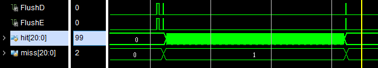

# Lab4 分支预测

**PB15020718 张立夫**

## 真值表

| BTB  | BHT  | REAL | NPC_PRED | flush | NPC_REAL | BTB update |
| :--: | :--: | :--: | :------: | :---: | :------: | :--------: |
|  Y   |  Y   |  Y   |   BUF    |   N   |  BrNPC   |     N      |
|  Y   |  Y   |  N   |   BUF    |   Y   | PC_EX+4  |     Y      |
|  Y   |  N   |  Y   | PC_IF+4  |   Y   |  BrNPC   |     Y      |
|  Y   |  N   |  N   | PC_IF+4  |   N   | PC_IF+4  |     N      |
|  N   |  Y   |  Y   | PC_IF+4  |   Y   |  BrNPC   |     Y      |
|  N   |  Y   |  N   | PC_IF+4  |   N   | PC_IF+4  |     N      |
|  N   |  N   |  Y   | PC_IF+4  |   Y   |  BrNPC   |     Y      |
|  N   |  N   |  N   | PC_IF+4  |   N   | PC_IF+4  |     N      |

## 实验结果

对于分支指令来说，如果没有分支预测，则会在 EX 阶段进行分支判断后，只要进行了分支，就会对 ID 和 EX 段的段寄存器进行 flush；如果有分支预测，则只会在进行了分支并且分支预测错误的条件下进行 flush。所以下面的实验结果，通过统计 flush 的次数，即可得到 hit 和 miss 的次数，以及算出不进行分支跳转的的代价。

###1. btb.S

#### 1.1 BTB

####1.2 BHT

### 2. bht.S

#### 2.1 BTB

####2.2 BHT

## 性能分析

####1. 对于一条分支指令，当动态分支预测命中，实际命中时，比不用分支预测少用几个周期？

当动态分支预测命中且实际命中时，则不需要 Stall 和 Flush，即不会多出任何开销；而不是用分支预测时，则需要对 ID 和 EX 段寄存器进行 Flush，所以会有两个时钟周期的延误，故会少用两个时钟周期。

####2. 对于一条分支指令，动态分支预测失败比非跳转指令多用几个周期？

对于一条分支指令，分支预测失败需要 Flush 掉 ID 和 EX 段寄存器，所以会比非跳转指令多两个周期。

#### 3. 统计未使⽤分⽀预测和使⽤分⽀预测的总周期数及差值

对于 btb.S：

- 不使用分支预测：510 周期
- 使用 BTB：314 周期，与不使用分支预测差值为：196
- 使用 BHT：314 周期，与不使用分支预测差值为：196

对于 bht.S：

- 不使用分支预测：536 周期
- 使用 BTB：382 周期，与不使用分支预测差值为：154
- 使用 BHT：364 周期，与不使用分支预测差值为：172

#### 4. 统计分⽀指令数⽬、动态分⽀预测正确次数和错误次数

根据上面的结果图即可得到：

|       | BTB 预测正确 | BTB 预测错误 | BHT 预测正确 | BHT 预测错误 |
| :---: | :----------: | :----------: | :----------: | :----------: |
| btb.S |      99      |      2       |      99      |      2       |
| bht.S |      88      |      22      |      97      |      13      |

#### 5. 对⽐不同策略并分析以上⼏点的关系

可以看到上面 BHT 和 BTB 在 btb.S 的表现相同，但是在 bht.S 指令中，BHT 的预测正确率则要更高。通过阅读 bht.S 源码可以知道，在内层循环结束时，只会有一次不进行分支，在这一次不进行分支时，BTB 则会修改其预测结果，而 BHT 则不会，所以 BHT 在该指令下表现更好。

#### 6. 计算整体CPI和加速⽐

btb.S 和 bht.S 中的指令数分别为 307 和 335，整体加速比和CPI如下：

对于 btb.S：

- 不使用分支预测，CPI：1.66，加速比：1.0
- 使用 BTB，CPI：1.02，加速比：1.63
- 使用 BHT，CPI：1.02，加速比：1.63

对于 bht.S：

- 不使用分支预测，CPI：1.60，加速比：1.0
- 使用 BTB，CPI：1.14，加速比：1.40
- 使用 BHT，CPI：1.09，加速比：1.47

