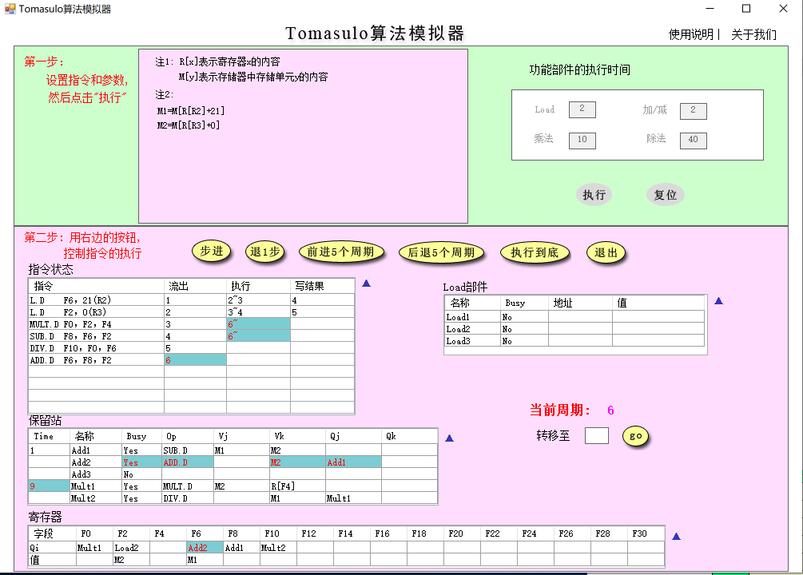
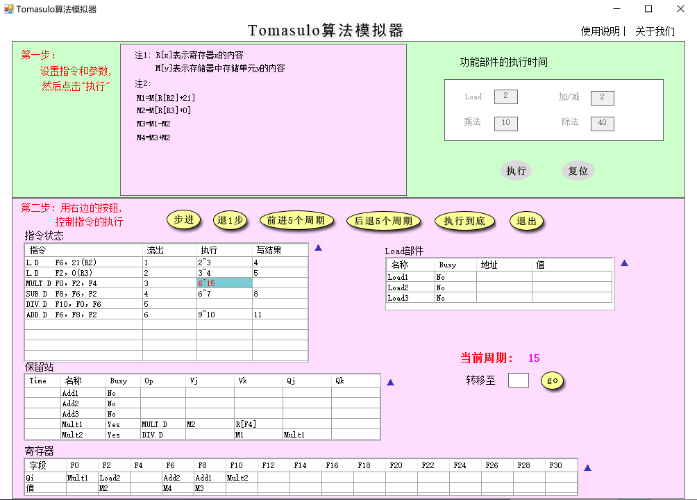
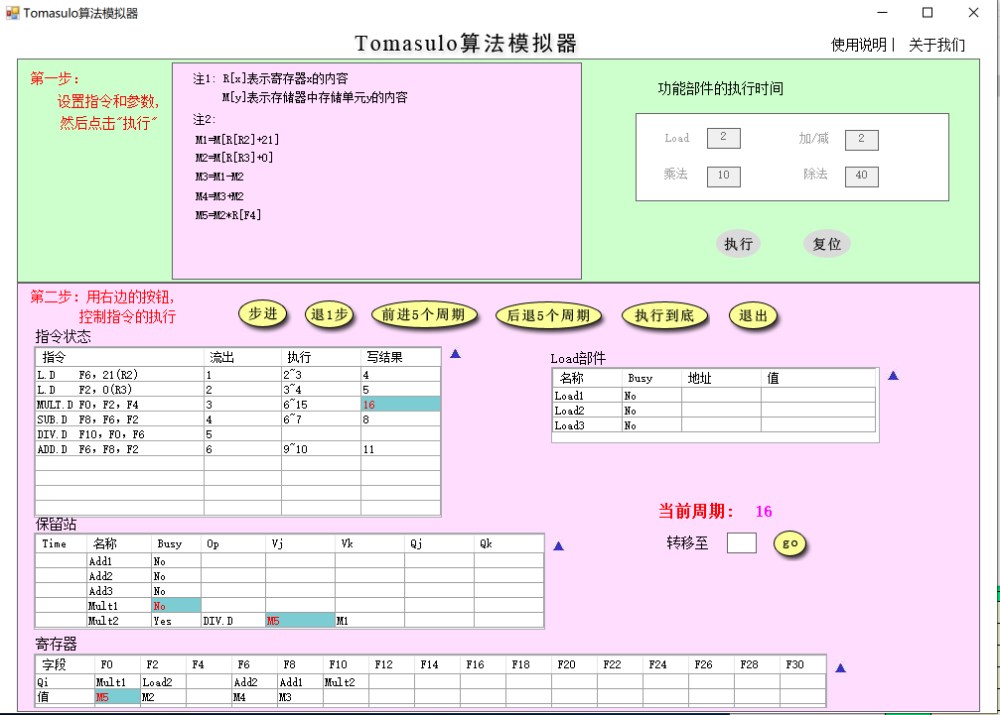
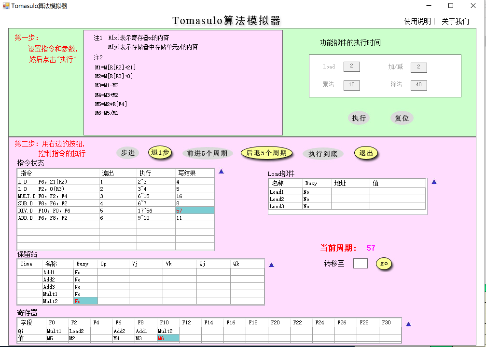
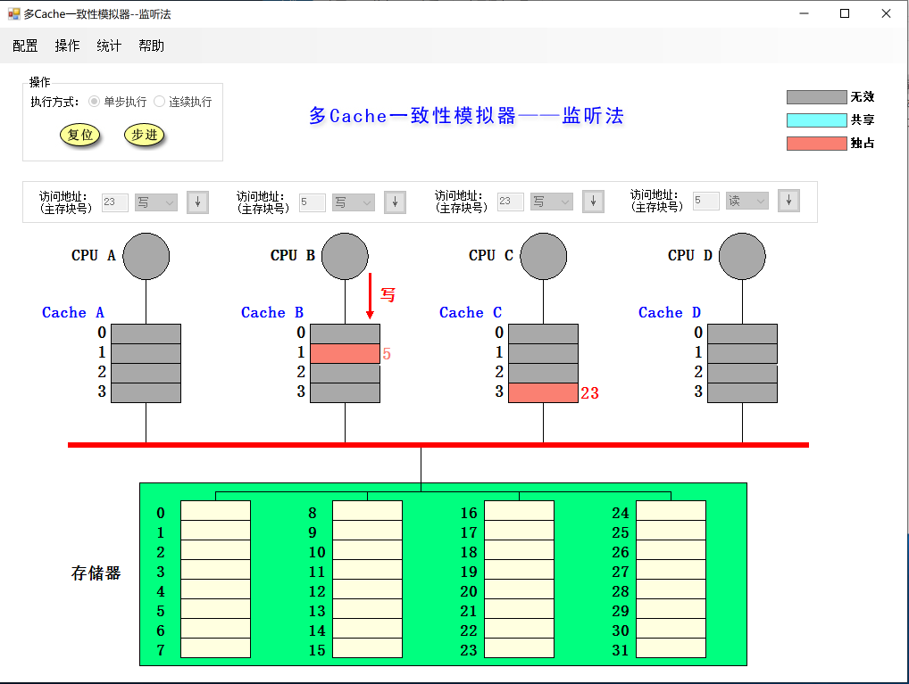
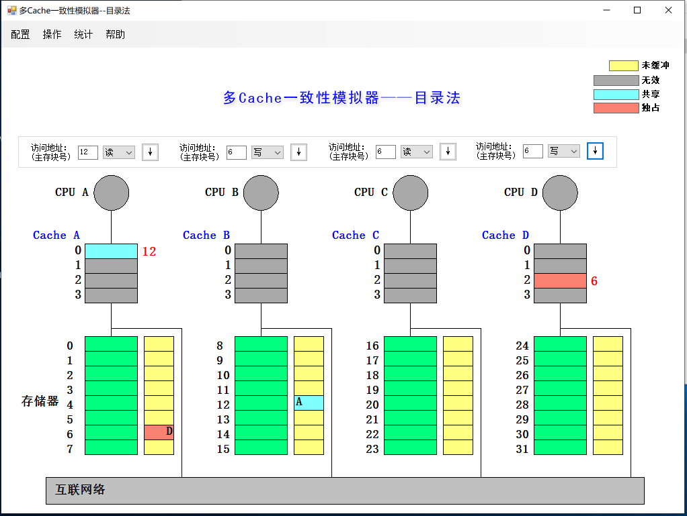

# Lab5 Tomasulo和cache一致性

**PB15020718 张立夫**

## Tomasulo 算法模拟器

**使用模拟器进行以下指令流的执行并对模拟器截图、回答问题**

```
L.D  F6, 21（R2）
L.D  F2, 0（R3）
MUL.D    F0, F2, F4
SUB.D     F8, F6, F2
DIV.D     F10, F0, F6
ADD.D    F6, F8, F2
```

假设浮点功能部件的延迟时间：加减法2个周期，乘法10个周期，load/store2个周期，除法40个周期。

1. **分别截图（当前周期2和当前周期3），请简要说明load部件做了什么改动**

周期2：


周期3：


改动：

两条 load 指令分别在 Load1 和 Load2 部件执行，在第二周期，Load1 部件开始执行，得到地址进行取值，Load2 部件得到流出的指令。在第三周期，Load1 部件执行结束，得到取出结果，Load2 部件得到地址进行取值执行。

2. **请截图（MUL.D刚开始执行时系统状态），并说明该周期相比上一周期整个系统发生了哪些改动（指令状态、保留站、寄存器和Load部件）**



- 指令状态：MULT.D 和 SUB.D 开始执行，ADD.D 开始流出；
- 保留站：因为 ADD.D 流出，所以 Add2 设置为 ADD.D 的相关参数，因为第一个源操作数依赖 SUB.D 的结果，所以 Qj = Add1；
- 寄存器：寄存器中 F6 为 Add2 的目的寄存器；
- Load 部件：无变化。

3. **简要说明是什么相关导致MUL.D流出后没有立即执行**

因为其中的一个源操作数 F2 要在 L.D 指令之后才能得到，即有 RAW 相关，所以需要等 L.D 执行结束后才能执行。

4. **请分别截图（15周期和16周期的系统状态），并分析系统发生了哪些变化**

周期15：



周期16：



- 指令状态：MULT.D 指令执行结束，进行结果写回；
- 保留站：MULT.D 指令执行结束，Mult1 单元清空，Busy 位置为 No；
- 寄存器：将 F0 寄存器的值改写为 MULT.D 指令运算的结果；
- Load 部件：无变化。

5. **回答所有指令刚刚执行完毕时是第多少周期，同时请截图（最后一条指令写CBD时认为指令流执行结束）**



执行完是 57 周期。

## 多cache一致性算法-监听法

1. **利用模拟器进行下述操作，并填写下表**

|  所进行的访问  | 是否发生了替换？ | 是否发生了写回？ | 监听协议进行的操作与块状态改变                               |
| :------------: | :--------------: | :--------------: | ------------------------------------------------------------ |
| CPU A 读第5块  |        N         |        N         | 向总线发送读不命中，从存储器中取数据，状态改为共享           |
| CPU B 读第5块  |        N         |        N         | 向总线发送读不命中，从存储器中取数据，状态改为共享           |
| CPU C 读第5块  |        N         |        N         | 向总线发送读不命中，从存储器中取数据，状态改为共享           |
| CPU B 写第5块  |        N         |        N         | 向总线发送作废，其他 Cache 中数据作废，Cache B 中状态为独占  |
| CPU D 读第5块  |        N         |        Y         | 向总线发送读不命中，Cache B 中的数据写回，状态改为共享，Cache D 从存储器中取数据，状态改为共享 |
| CPU B 写第21块 |        Y         |        N         | 向总线发送写不命中，从存储器中取 21 数据，替换第 1 块，状态改为独占 |
| CPU A 写第23块 |        N         |        N         | 向总线发送写不命中，从存储器中取 23 数据，写入数据，状态改为独占 |
| CPU C 写第23块 |        N         |        Y         | 向总线发送写不命中，Cache A 中的数据写回，状态改为无效，Cache C 从存储器中取数据，写入数据，状态改为独占 |
| CPU B 读第29块 |        Y         |        Y         | 写回 21，向总线发送读不命中，从存储器中读取数据，状态改为共享 |
| CPU B 写第5块  |        Y         |        N         | 向总线发送写不命中，从存储器读取数据，写入数据，状态改为独占，将其他 Cache 中数据作废 |

2. **请截图，展示执行完以上操作后整个cache系统的状态。**




##多cache一致性算法-目录法

1. **利用模拟器进行下述操作，并填写下表**

|  所进行的访问  |                监听协议进行的操作与块状态改变                |
| :------------: | :----------------------------------------------------------: |
| CPU A 读第6块  |   读不命中，本地宿主 A 发送数据到 Cache A，共享集合为 {A}    |
| CPU B 读第6块  |   读不命中，远程宿主 A 发送数据到 Cache B，共享集合为 {AB}   |
| CPU D 读第6块  |  读不命中，远程宿主 A 发送数据到 Cache D，共享集合为 {ABD}   |
| CPU B 写第6块  | 写命中，将 Cache AD 中数据作废，写入 Cache B，状态改为独占，共享集合为独占 {B} |
| CPU C 读第6块  | 读不命中，从 Cache B 取数据块到存储器，状态改为共享，远程宿主 A 发送数据到 Cache C，共享集合为 {BC} |
| CPU D 写第20块 |   写不命中，远程宿主 C 发送数据到 Cache D，状态均改为独占    |
| CPU A 写第20块 | 写不命中，远程宿主 C 从 Cache D 中取数据并将其作废，之后将数据发送给 Cache A，状态改为独占 |
| CPU D 写第6块  | 写不命中，远程宿主 A 发送作废信息给 Cache BC，将数据发送给 Cache D，状态改为独占 |
| CPU A 读第12块 | 读不命中，将 20 数据写回并修改共享集，发送读不命中到宿主 B，宿主 B 发送数据到 Cache A，状态为共享 |

2. **请截图，展示执行完以上操作后整个cache系统的状态。**




## 综合问答

1. **目录法和监听法分别是集中式和基于总线，两者优劣是什么？（言之有理即可）**

答：目录法使用互联网络实现，需要较低的延迟，所以其实现的复杂度与难度较高，但是其减少了总线的使用，使读取本地数据时的速度有所提升；监听法依靠总线进行数据传输，总线与单一主存成为限制性能的关键，对于大量数据读取写入时，总线负担压力太重，但是该结构实现简单。

2. **Tomasulo算法相比Score Board算法有什么异同？（简要回答两点：1.分别解决了什么相关，2.分别是分布式还是集中式）（参考第五版教材）**

- Tomasulo：解决了 WAW 和 WAR 冒险，分布式；
- Score Board：同样解决了 WAW 和 WAR 冒险，但是是通过 Stall 来进行实现，集中式。

3. **Tomasulo算法是如何解决结构、RAW、WAR和WAW相关的？（参考第五版教材）**

- 结构相关：结构冲突时不发射即可避免；
- RAW：仅在操作数可用时再进行执行指令即可避免；
- WAR & WAW：使用寄存器重命名的方式进行实现。